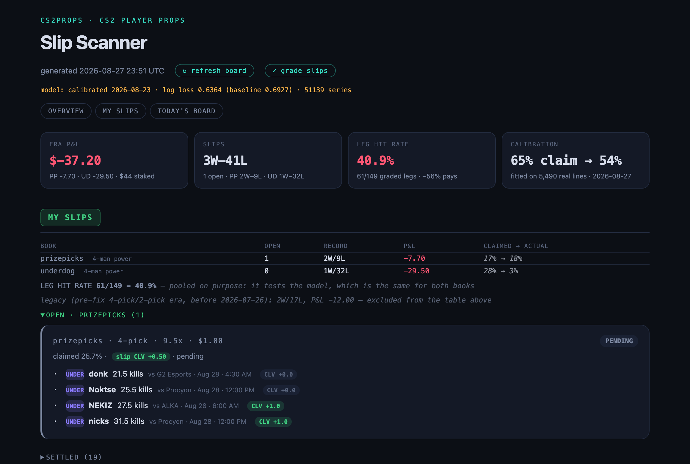
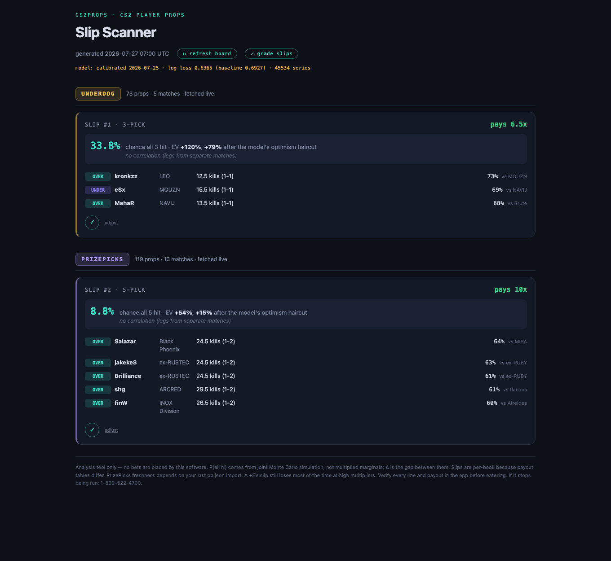

# cs2props


**A stats model for Counter-Strike 2 player props — it prices the bets,
tracks every one I place, and grades its own accuracy.**

Apps like PrizePicks and Underdog let you bet on stat lines for pro CS2
players ("will this player get more or less than 24.5 kills?"). This project
asks one question: **can a model find lines those apps have priced wrong?**

It doesn't just guess. It keeps score on itself — every bet is logged, graded
against real match results, and the model automatically discounts its own
confidence when its live record says it's been too optimistic.

**Most days it says "no bets today."** That's a feature. A tool that always
finds you a bet is selling you action, not an edge.

## What it looks like

The local dashboard opens with a scoreboard: profit/loss, the win/loss
record per book, how often the model's picks actually hit, and — the
honest part — how big a "skepticism discount" the model is currently
applying to itself because of its own recent misses. One click refreshes
the board or grades finished bets; every open bet shows whether the line
moved in my favor after I placed it.



When the model *does* find something, it shows a card: what the bet pays,
how often the simulation thinks it hits, and the expected value — before
and after the skepticism discount. The ✓ button logs the bet for tracking.
Note the amber box: the model *wanted* a 4th pick here and refused to add
one, because no available pick was good enough. It says so instead of
padding the slip.



## How it works, in five steps

1. **Learn the players.** A year of pro match history — about 155,000
   individual map performances. Recent games count more than old ones.
2. **Simulate every match 50,000 times.** Not "he averages 25 kills" — it
   plays out the whole game: how long the series goes, who wins each map,
   how many rounds, and how the kills fall. The probability of a bet hitting
   is just how often it hit across 50,000 simulated games.
3. **Respect the bookmaker.** The model blends its own estimate with the
   book's line, because the line contains information the model can't see
   (roster news, sharp money). Then every probability is passed through a
   *calibration map* learned from thousands of the model's own graded
   predictions — it answers "when the model says 65%, what actually
   happens?" and prices the bet with that instead (see "The reckoning"
   below for why this exists).
4. **Price the bet at what the book actually pays.** The apps quietly reduce
   payouts for certain slip structures — put four teammates on one slip and
   "10x" silently becomes 5x. Those rules aren't documented anywhere; they
   were worked out by building test slips in the apps and reading what they
   quoted. The optimizer prices every slip at the number the app will
   actually pay, and only builds the one structure the pricing leaves
   underpriced (see below).
5. **Keep score.** Every bet is graded automatically when matches finish.
   The running hit rate is the whole experiment: the legs need to hit ~54%
   for the math to work, and the record says whether they do.

## What I learned building it

- **A model can be "accurate" and still lose.** The model predicts player
  stats well by standard measures — but the books' lines are built from the
  same public data, so being accurate isn't enough. You have to know
  something the line doesn't. Testing against the books' *real* lines
  (not the model's own practice questions) was the honest test.
- **The payout fine print matters more than the model.** Choosing the wrong
  bet type on the same predictions swings the outcome by 30+ points of
  expected value. The biggest single improvement to this project wasn't a
  smarter model — it was reading the payout rules carefully.
- **Correlation is real, and the books price it almost perfectly.**
  Teammates' kill counts rise and fall together, so a slip stacking
  teammates wins more often — and the apps cut its payout by almost exactly
  what that boost is worth. Measuring both sides revealed one gap: a
  *single* teammate pair boosts the win chance ~16% but is barely charged
  for (one app takes 5%, the other nothing). So every suggested slip has
  exactly one teammate pair plus singles from other matches — the only
  structure where you keep more than you give up. Deeper stacks look
  exciting and are quietly the worst deal on the board.
- **Most bugs look like profits or losses.** A rounding case silently
  counted as a win, a grader once read the wrong match, a query mixed the two
  books' lines. Each produced a confident, wrong conclusion. Each is now a
  regression test.

## The reckoning: when the model's confidence turned out to be empty

A month of tracked bets produced the project's most important finding — and
it's about the model itself.

After ~150 graded bets, the legs the model claimed would hit ~68% of the
time were hitting **41%**. That could have been bad luck, so the question
went to the biggest sample available: 5,490 real book lines, archived
before each match and graded after. Bucketing the model's picks by how
confident it was gave this:

| model claimed | actually hit |
|---|---|
| 55–60% | 51% |
| 60–65% | 58% |
| 65–70% | 51% |
| 70%+ | 58% |

**Flat.** Above the pick threshold, the model's *extra* confidence carried
no information — a "72% lock" and a "57% lean" were both ~54% picks. And
the optimizer was built to chase exactly that empty confidence: it selected
the highest claims, priced bets off them, and compounded the error four
legs at a time.

The fix was to stop trusting the model about itself:

1. **A fitted calibration map replaced the flat discount.** Instead of
   "subtract a few points from every claim," each probability is remapped
   to what claims like it *actually hit* in the archive (65% → 54%,
   79% → 57%). It refits weekly, only ever discounts (a slice of the
   sample that overperformed never earns a boost — that's how bankrolls
   die), and every expected-value number now flows through it.
2. **Matches with substitute players became no-bet.** Live results ran
   well below the backtest during a stretch where most matches fielded
   stand-ins. The model shaded its projections for them, but shading isn't
   knowledge — the book reprices on roster news the model can't see, so
   those matches are now excluded from betting entirely (they're still
   simulated and archived).
3. **A pre-committed hypothesis was executed, not renegotiated.** A side
   experiment bet that when the two books disagreed on a line, the pricier
   line was wrong. The kill criteria were written down *in advance* — at
   400 settled cases, a lift under 5 points means the idea dies. The lift
   went +15.6 → +6.9 → **+0.0** as the sample grew from 57 to 1,037: a
   textbook noise mirage. It died on schedule, per the rule, with no
   searching for a friendlier slice of the data.

The uncomfortable consequence, stated plainly: with honest probabilities,
most bets that used to look great price out at roughly breakeven, and the
scanner now says "no slips today" far more often. That's not the tool
breaking — that's the tool finally telling the truth. The interesting
question it's now equipped to answer is whether any real edge survives
honest pricing.

## Where it stands

The live record is small and not profitable — the dashboard says so out
loud, and the section above explains why. What this repo demonstrates is
the instrument: a system that archives its predictions before the outcome,
grades itself against reality, catches its own overconfidence with data,
and executes pre-committed decisions even when they kill a favorite
hypothesis. The balance is a result; the discipline is the product.

## Tech

Python 3.11+ · fully type-hinted (`mypy` clean) · 263 tests · SQLite ·
Monte Carlo simulation · walk-forward backtesting · a stdlib-only web
dashboard · `uv` for everything.

```bash
uv run cs2props scan          # fetch boards, simulate, suggest slips
uv run cs2props serve         # local dashboard
uv run cs2props calibrate     # backtest the model against history
uv run cs2props reallines     # backtest against real archived book lines
uv run pytest && uv run mypy cs2props/
```

## Disclaimer

Personal research project. Not affiliated with any sportsbook or data
provider. Nothing here is betting advice — the dashboard itself documents
the model losing money. Scraped data and my own betting records are excluded
from this repository.
